# Raport ze Wstępnej Analizy Danych (Zadanie 1)

## 1. Podstawowe Statystyki Opisowe (Ogółem)

Badana próba liczy **78** uczniów siódmej klasy. Poniższa tabela prezentuje zestawienie podstawowych statystyk dla zmiennych ilościowych: Średniej Ocen (ŚrOc), IQ oraz punktacji w teście psychologicznym (PH).

| Statystyka | ŚrOc | IQ | PH |
| :--- | :---: | :---: | :---: |
| **Średnia** | 7.45 | 108.92 | 56.96 |
| **Mediana** | 7.83 | 110.00 | 59.50 |
| **Minimum** | 0.53 | 72.00 | 20.00 |
| **Maksimum** | 10.76 | 136.00 | 80.00 |
| **Kwartyl dolny (Q1)** | 6.23 | 103.00 | 51.00 |
| **Kwartyl górny (Q3)** | 9.00 | 118.00 | 66.00 |
| **Wariancja (z próby)** | 4.41 | 173.47 | 154.06 |
| **Odchylenie standardowe** | 2.10 | 13.17 | 12.41 |
| **Wsp. zmienności (CV)** | 28.20% | 12.09% | 21.79% |

**Wnioski z obliczonych statystyk (Zad. 1a):**
> *[Tutaj wpisz swoje wnioski - np. która zmienna ma największy rozrzut na podstawie współczynnika zmienności (CV)]*

\newpage

## 2. Wizualizacja Danych (Histogramy i Boxploty)

Poniższe wykresy prezentują rozkłady badanych cech. Dla zachowania czytelności, obok histogramu prezentującego rozkład częstości, umieszczono odpowiadający mu wykres ramkowy.

### Zmienna: Rozkład IQ
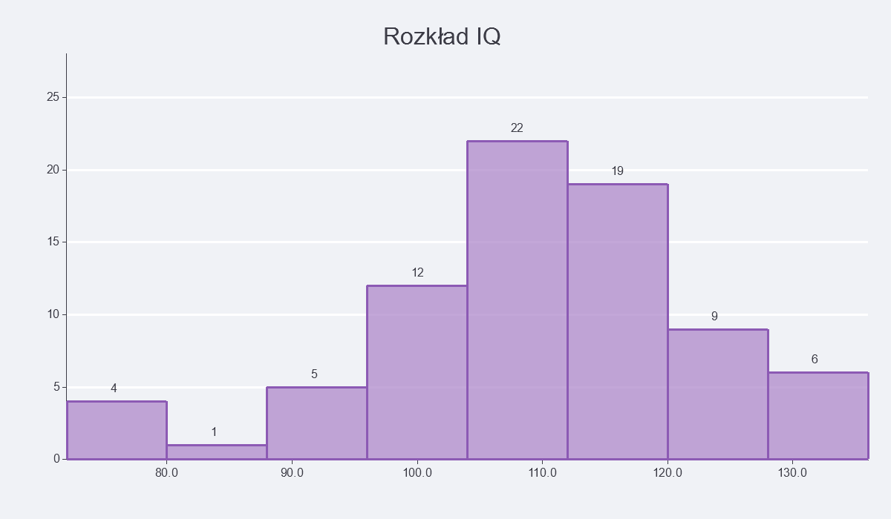{width=49%} 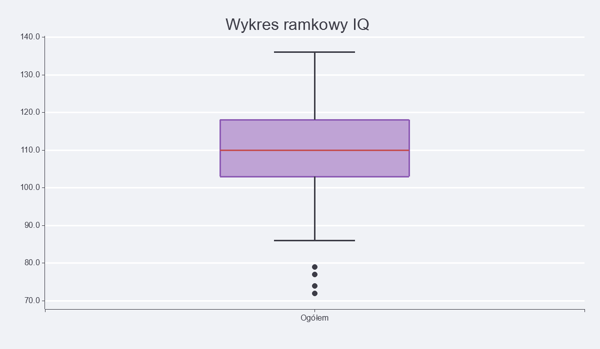{width=49%}

### Zmienna: Średnia Ocen (ŚrOc)
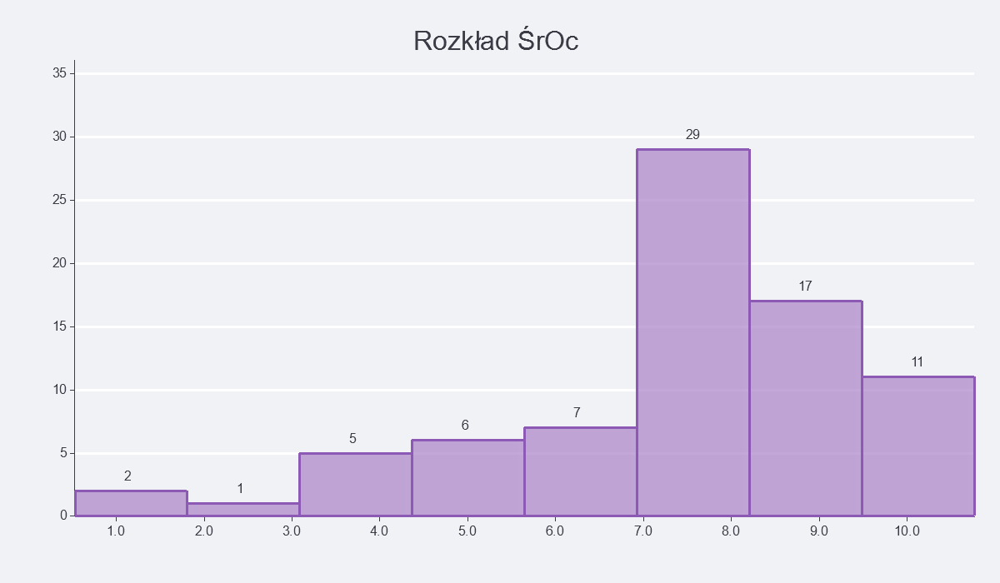{width=49%} 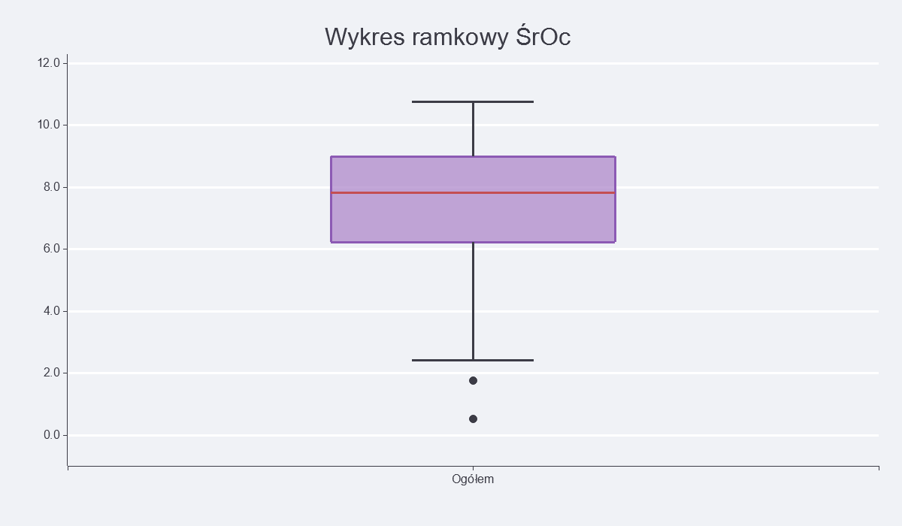{width=49%}

### Zmienna: Punktacja Psychologiczna (PH)
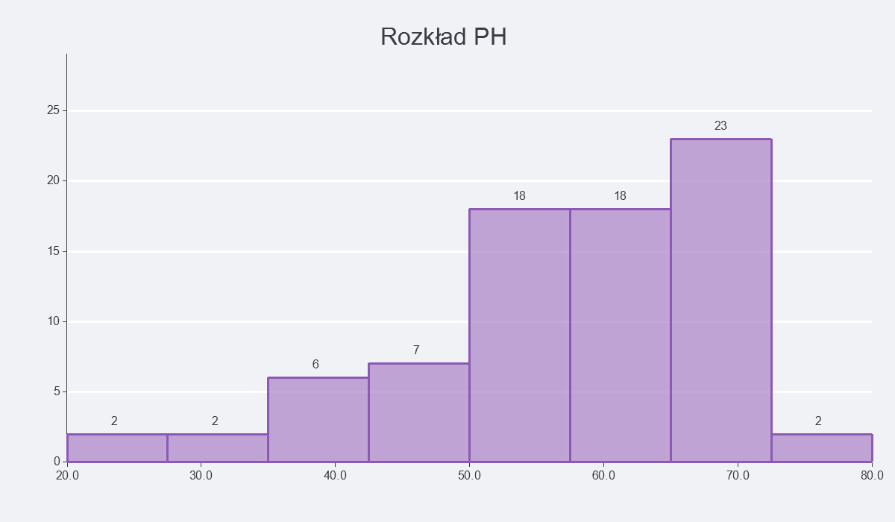{width=49%} 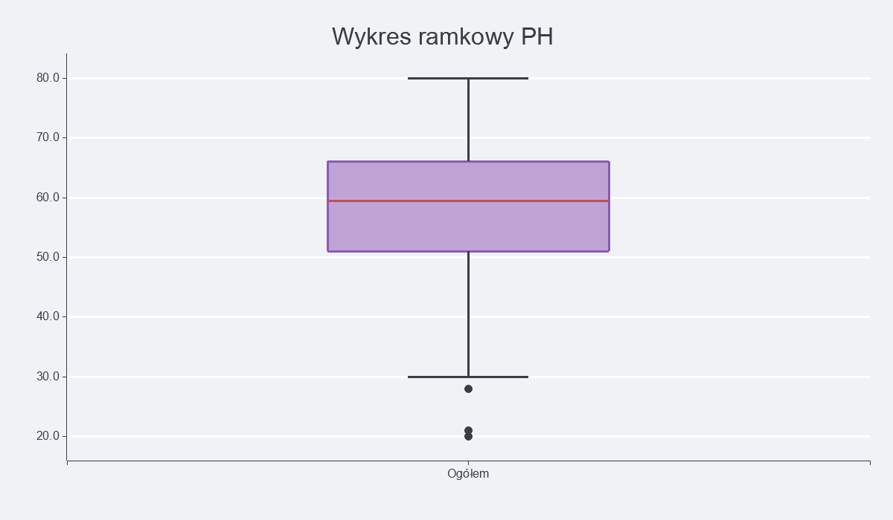{width=49%}

**Wnioski na podstawie wykresów (Zad. 1b):**
> *[Tutaj skomentuj kształty rozkładów: czy są symetryczne, skośne, czy występują wartości odstające (kropki na boxplotach)]*

\newpage

## 3. Porównanie: Chłopcy vs Dziewczęta

Poniżej zestawiono wyniki z podziałem na płeć badanych uczniów.

| Statystyka | IQ (Chłopcy) | IQ (Dziewczęta) | ŚrOc (Chłopcy) | ŚrOc (Dziewczęta) |
| :--- | :---: | :---: | :---: | :---: |
| **Średnia** | 111.35 | 105.44 | 7.28 | 7.68 |
| **Mediana** | 111.00 | 106.00 | 7.88 | 7.83 |

### Wykresy Porównawcze

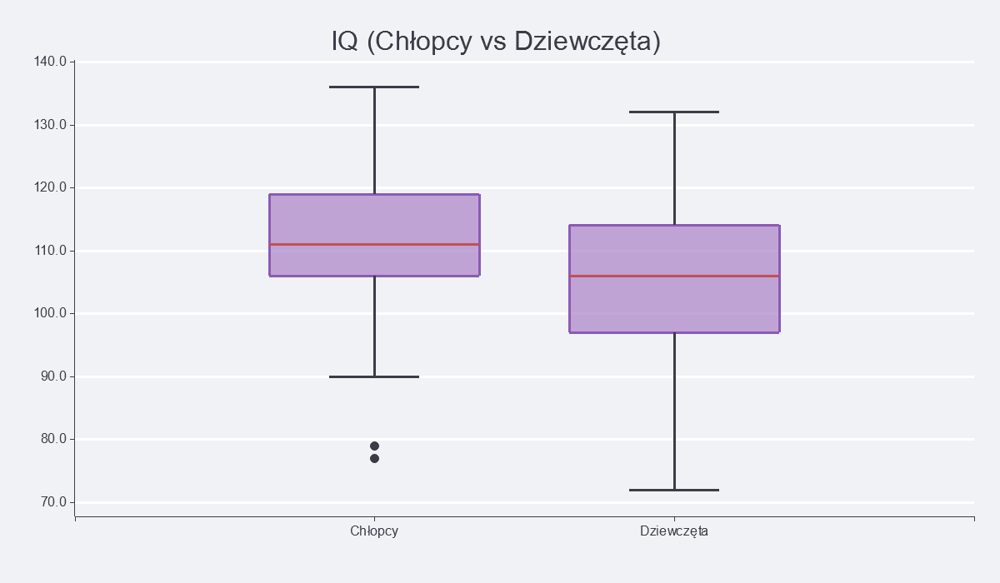{width=49%} 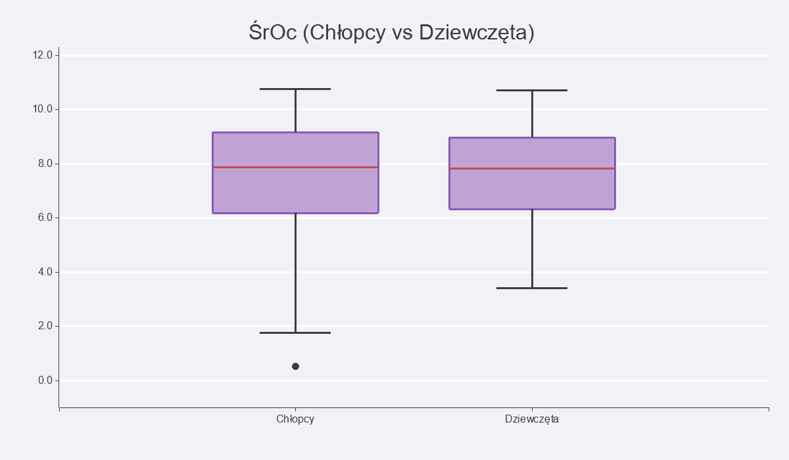{width=49%}

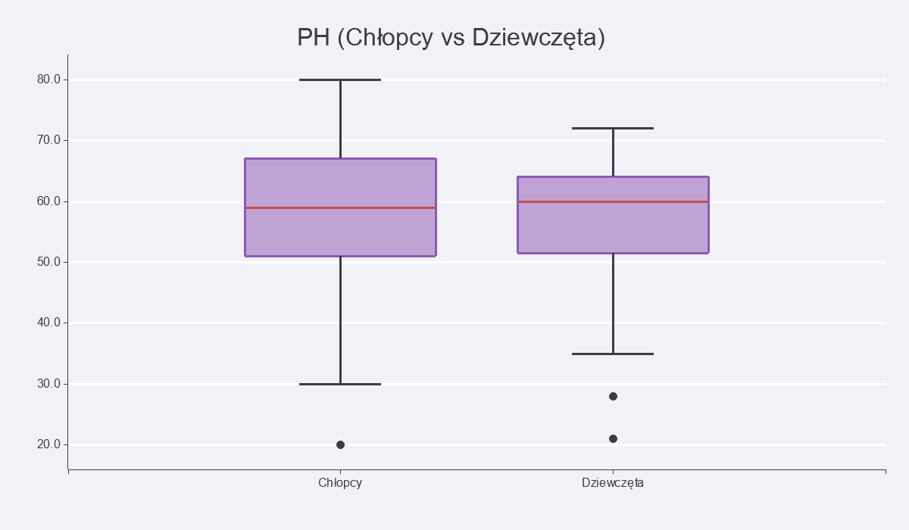{width=70%}

**Porównanie wyników (Zad. 1c):**
> *[Tutaj skomentuj różnice. Kto radzi sobie lepiej pod kątem ocen, a kto pod kątem IQ?]*

\newpage

## 4. Wpływ liczby klas na histogram (Zad. 1d)

Analiza dla wybranej zmiennej (**IQ**) przy różnej szerokości przedziałów klasowych.

### Zbyt mało klas (Liczba klas: 3)

Zamazuje to strukturę danych, tracimy cenne informacje o rzeczywistym kształcie rozkładu.

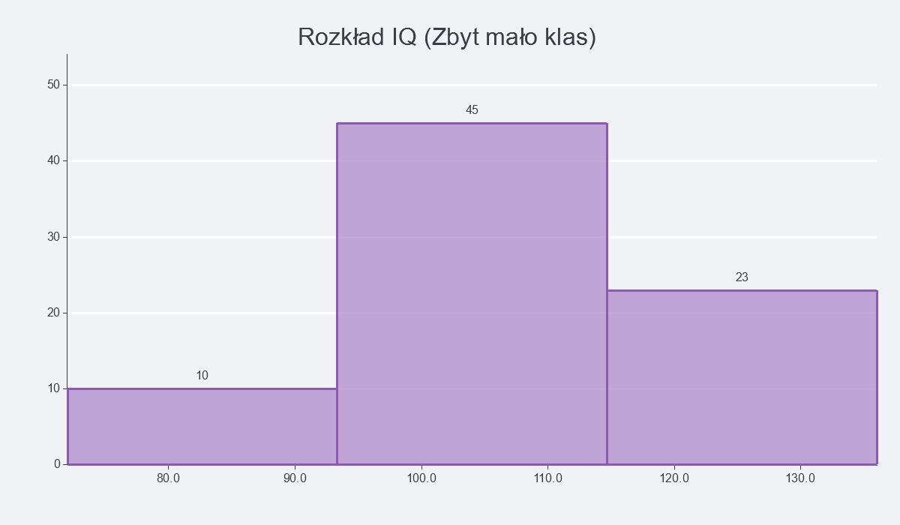{width=75%}

### Optymalna liczba klas (Liczba klas: 8)

Wyliczona na podstawie Reguły Sturgesa. Najlepiej oddaje charakterystykę badanej grupy.

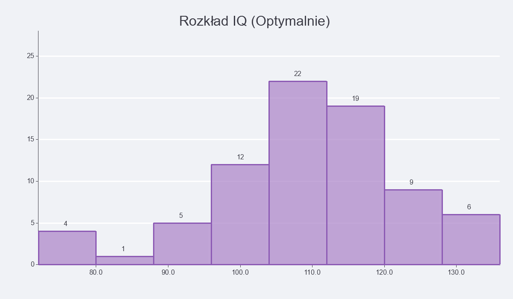{width=75%}

### Zbyt dużo klas (Liczba klas: 30)

Powoduje poszarpanie wykresu (tzw. szum informacyjny), pojawiają się puste luki między słupkami.

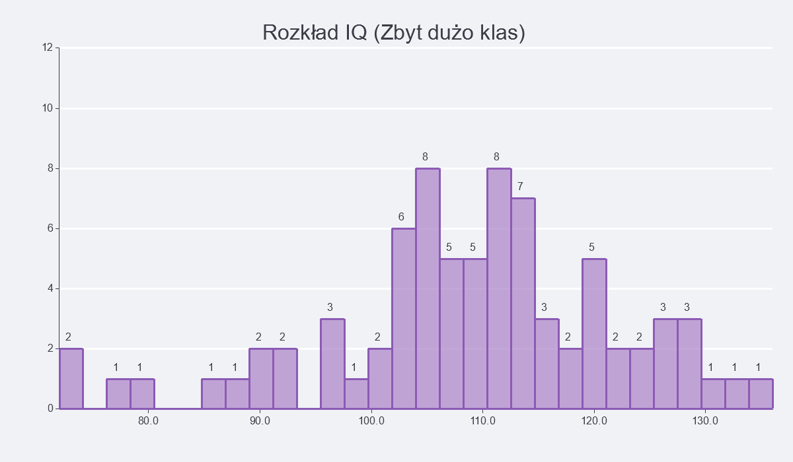{width=75%}

**Wniosek:**
> *Wybór zbyt małej liczby klas uogólnia dane (tzw. over-smoothing), ukrywając istotne niuanse rozkładu, natomiast zbyt duża liczba klas dzieli dane na tak małe przedziały, że trudno wychwycić główny trend. Złotym środkiem w tym wypadku okazała się Reguła Sturgesa.*