# Raport ze Wstępnej Analizy Danych (Zadanie 1)

## 1. Podstawowe Statystyki Opisowe (Ogółem)

Badana próba liczy **18** uczniów siódmej klasy. Poniższa tabela prezentuje zestawienie podstawowych statystyk dla zmiennych ilościowych: Średniej Ocen (ŚrOc), IQ oraz punktacji w teście psychologicznym (PH).

| Statystyka | ŚrOc | IQ | PH |
| :--- | :---: | :---: | :---: |
| **Średnia** | 6.50 | 105.17 | 59.44 |
| **Mediana** | 6.50 | 104.50 | 60.00 |
| **Minimum** | 3.00 | 70.00 | 40.00 |
| **Maksimum** | 10.00 | 145.00 | 80.00 |
| **Kwartyl dolny (Q1)** | 5.00 | 100.00 | 50.00 |
| **Kwartyl górny (Q3)** | 8.00 | 110.00 | 65.00 |
| **Wariancja (z próby)** | 3.79 | 209.79 | 111.44 |
| **Odchylenie standardowe** | 1.95 | 14.48 | 10.56 |
| **Wsp. zmienności (CV)** | 29.97% | 13.77% | 17.76% |

**Wnioski z obliczonych statystyk (Zad. 1a):**
> *[Tutaj wpisz swoje wnioski - np. która zmienna ma największy rozrzut na podstawie współczynnika zmienności]*

---

## 2. Wizualizacja Danych (Histogramy i Boxploty)

### Zmienna: Rozkład IQ
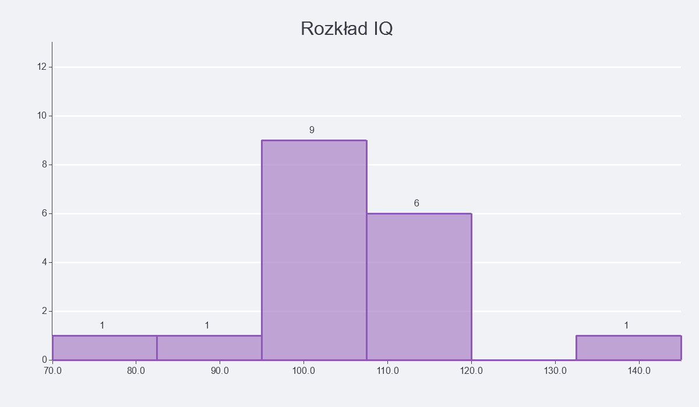
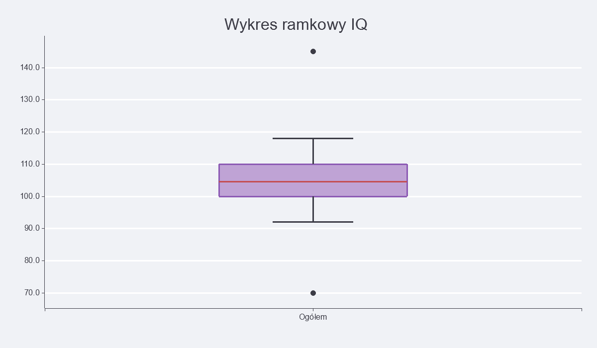

### Zmienna: Średnia Ocen (ŚrOc)
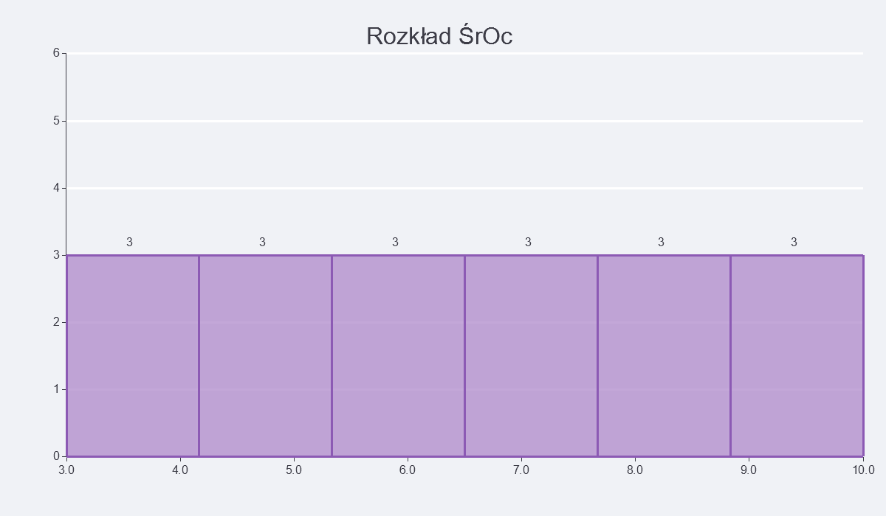
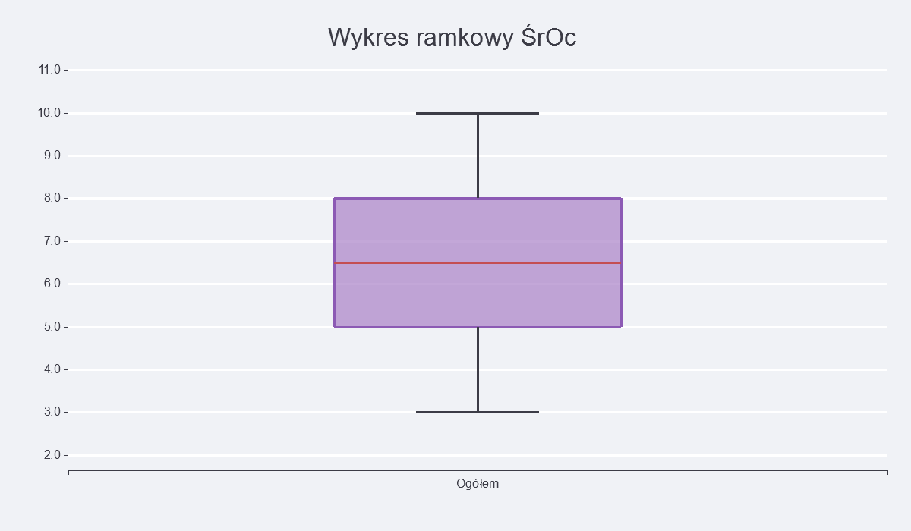

### Zmienna: Punktacja Psychologiczna (PH)
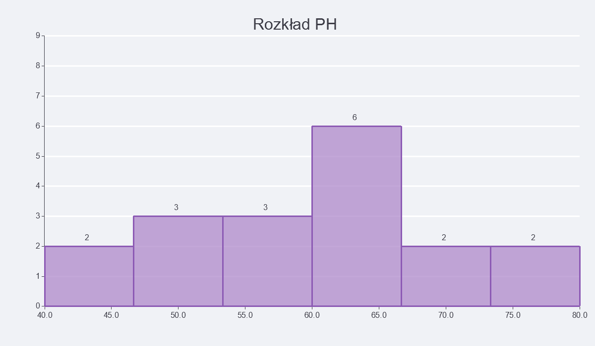
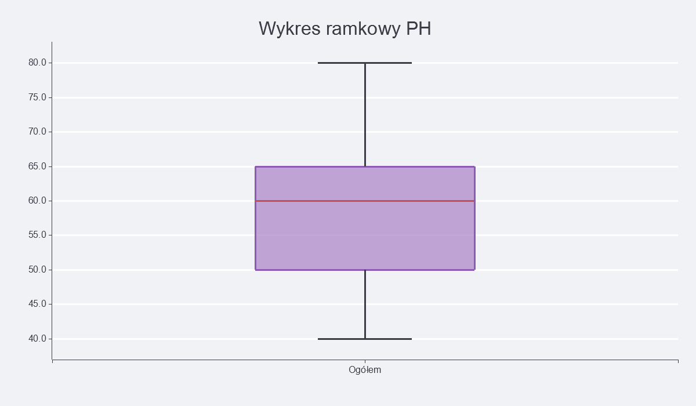

**Wnioski na podstawie wykresów (Zad. 1b):**
> *[Tutaj skomentuj kształty rozkładów: czy są symetryczne, skośne, czy występują wartości odstające (kropki na boxplotach)]*

---

## 3. Porównanie: Chłopcy vs Dziewczęta

Poniżej zestawiono średnie i mediany z podziałem na płeć:

| Statystyka | IQ (Chłopcy) | IQ (Dziewczęta) | ŚrOc (Chłopcy) | ŚrOc (Dziewczęta) |
| :--- | :---: | :---: | :---: | :---: |
| **Średnia** | 108.67 | 101.67 | 5.33 | 7.67 |
| **Mediana** | 105.00 | 104.00 | 5.00 | 8.00 |

### Wykresy Porównawcze

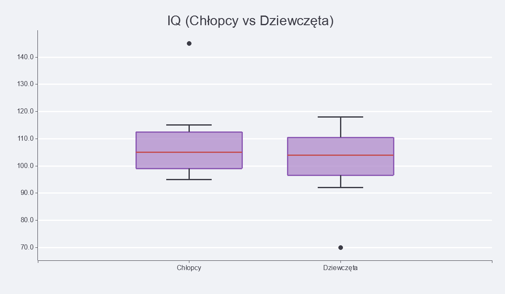
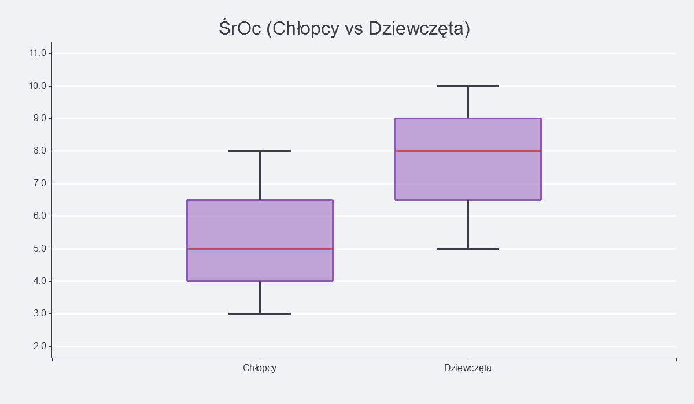
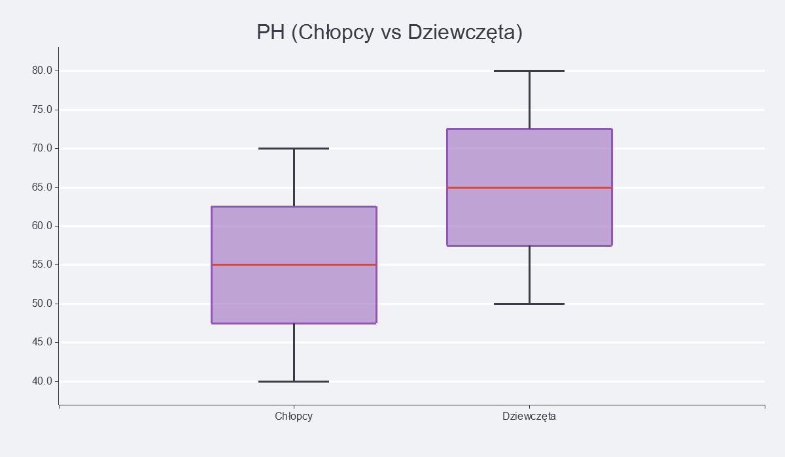

**Porównanie wyników (Zad. 1c):**
> *[Tutaj porównaj wyniki chłopców i dziewcząt na podstawie statystyk i ułożenia pudełek na wykresach]*

---

## 4. Wpływ liczby klas na histogram (Zadanie 1d)

Analiza dla wybranej zmiennej (IQ) przy różnej liczbie klas (szerokości przedziałów):

* **Zbyt mało klas (3):** Zamazuje to strukturę danych, tracimy informacje o kształcie rozkładu.
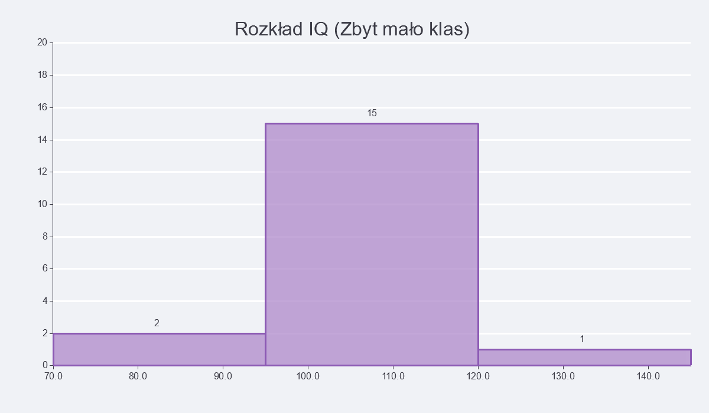
* **Optymalna liczba klas (6):** Wyliczona na podstawie Reguły Sturgesa. Najlepiej oddaje charakterystykę badanej grupy.
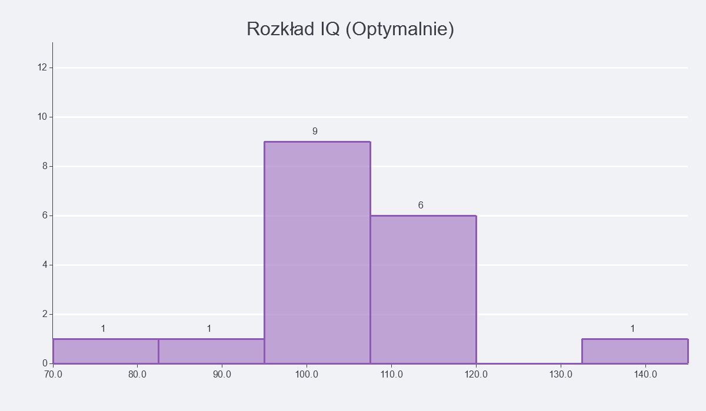
* **Zbyt dużo klas (30):** Powoduje poszarpanie wykresu (szum informacyjny), pojawiają się puste luki między słupkami.
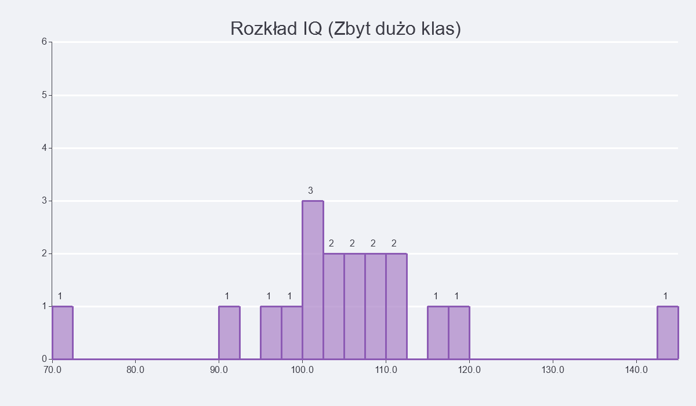

**Optymalna liczba klas:**
> *Optymalna liczba klas wynosi 6, ponieważ... [tutaj uzasadnij odwołując się do Reguły Sturgesa lub Freedmana-Diaconisa z wykładu]*